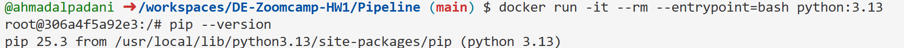
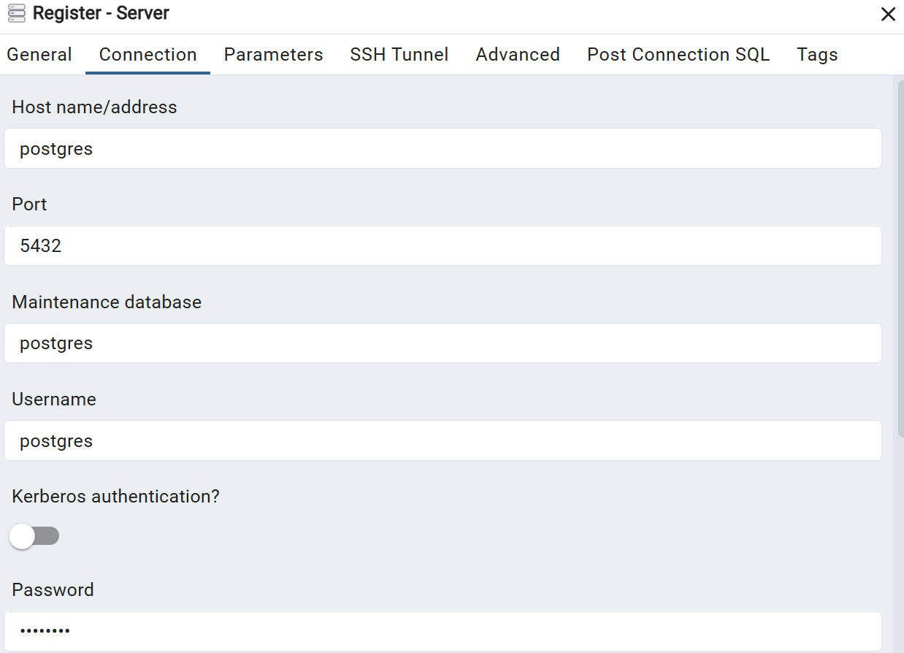
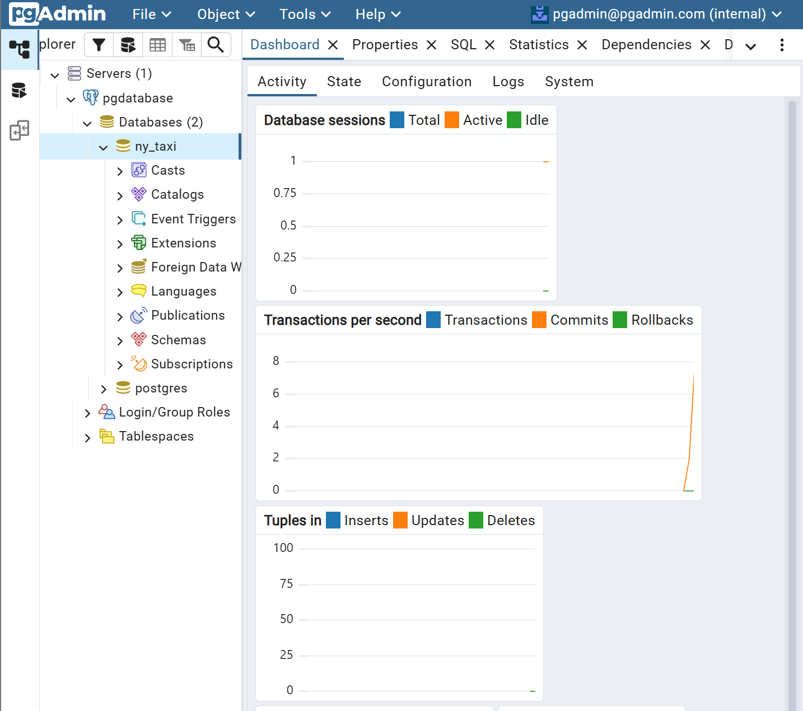
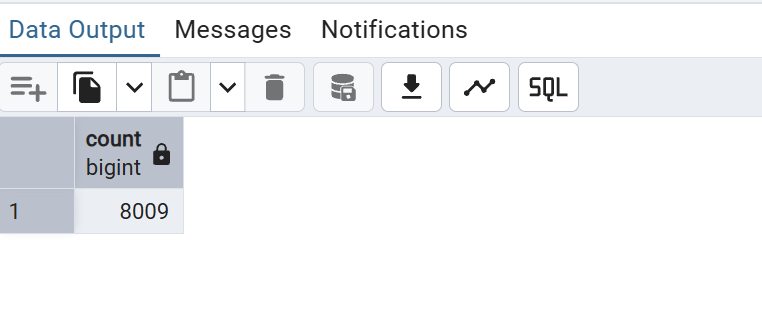
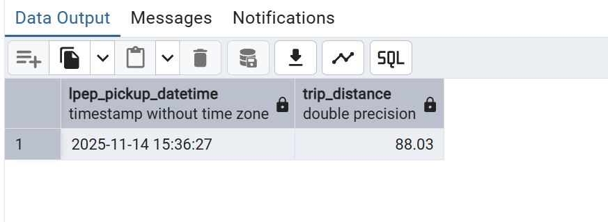
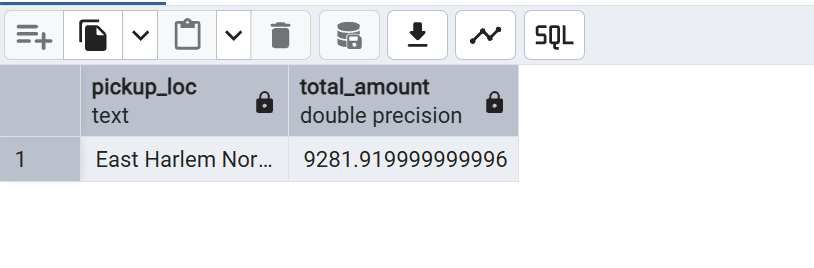
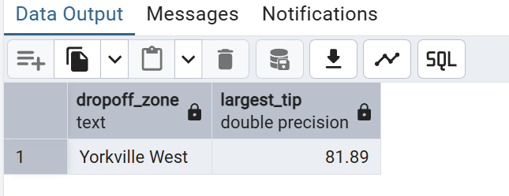

# DE-Zoomcamp-HW1

## Question 1:

### Step 1:
make container for image python=3.13

```bash
docker run -it --rm\
-v $(pwd)/app:app/test\
-- entrypoint=bash\
python:3.13
```
### Step 2:
Check the version of PIP

```bash
pip --version
```
### Output



## Question 2:

### Step 1:
Make docker-compose.yaml in our directory 

### Step 2:
run docker compose

```bash 
docker-compose up
```

### Step 3:
acsess pgAdmin in browser by browsing to http://localhost:8080

### Step 4:
Login with 
- email: pgadmin@pgadmin.com
- password: pgadmin

### Step 5:
Configure 

General tab: 
- Name: pgdatabase

Connection tab:
- Host: postgres (the container name)
- Port: 5432
- Username: postgres
- Password: postgres

### Output





## Preparation Before Question 3:

### Step 1 : donwload all data 

run 

```bash
wget https://github.com/DataTalksClub/nyc-tlc-data/releases/download/green/green_tripdata_2019-10.csv.gz 
wget https://github.com/DataTalksClub/nyc-tlc-data/releases/download/misc/taxi_zone_lookup.csv in our command line
``` 

makesure data has downloaded in our directory 

### Step 2: load data to postgres (you can refer to Pipeline/ingest_data.py )

```python 
import pandas as pd
from sqlalchemy import create_engine
import click


@click.command()
@click.option('--user', default='postgres', help='PostgreSQL user')
@click.option('--password', default='postgres', help='PostgreSQL password')
@click.option('--host', default='localhost', help='PostgreSQL host')
@click.option('--port', default=5433, type=int, help='PostgreSQL port')
@click.option('--db', default='ny_taxi', help='PostgreSQL database name')
@click.option('--table', default='ny_taxi_data', help='Target table name')
@click.option('--table1', default='ny_taxi_zone', help='Target table name')


def ingest_data(user, password, host, port, db, table, table1):
    
    engine = create_engine(
        f'postgresql://{user}:{password}@{host}:{port}/{db}'
    )

    df = pd.read_parquet("green_tripdata_2025-11.parquet")

    df1 = pd.read_csv('taxi_zone_lookup.csv')

    df.head(n=0).to_sql(
        name=table,
        con=engine,
        if_exists='replace'
    )


    df.to_sql(
        name=table,
        con=engine,
        if_exists='append'
    )
    print(f"Inserted data: {len(df)} rows")


    df1.head(n=0).to_sql(
        name=table1,
        con=engine,
        if_exists='replace'
    )

    df1.to_sql(
        name=table1,
        con=engine,
        if_exists='append'
    )
    print(f"Inserted data: {len(df1)} rows")

if __name__ == "__main__":
    ingest_data()
```

## Question 3:

```bash
SELECT COUNT(*)
FROM ny_taxi_data
WHERE trip_distance <= 1
AND lpep_pickup_datetime >= '2025-11-01'
AND lpep_pickup_datetime <  '2025-12-02';
```

### Output:



## Question 4:

```bash
SELECT lpep_pickup_datetime, trip_distance
FROM ny_taxi_data
WHERE trip_distance < 100
ORDER BY trip_distance DESC
LIMIT 1;
```

### Output:



## Question 5:

```bash 
SELECT
	zpu."Zone" AS "pickup_loc",
    SUM(t.total_amount) AS total_amount
FROM
    ny_taxi_data t
JOIN
    ny_taxi_zone zpu ON t."PULocationID" = zpu."LocationID"
WHERE lpep_pickup_datetime >= '2025-11-18' AND lpep_pickup_datetime < '2025-11-19'
GROUP BY pickup_loc
ORDER BY total_amount DESC
LIMIT 1;
```

### Output:



## Question 6:

```bash 
SELECT 
    zdo."Zone" AS dropoff_zone,
    MAX(d.tip_amount) AS largest_tip
FROM ny_taxi_data d
JOIN ny_taxi_zone zpu 
    ON d."PULocationID" = zpu."LocationID"
JOIN ny_taxi_zone zdo 
    ON d."DOLocationID" = zdo."LocationID"
WHERE 
    zpu."Zone" = 'East Harlem North'
    AND d.lpep_pickup_datetime >= '2025-11-01'
    AND d.lpep_pickup_datetime < '2025-12-01'
GROUP BY zdo."Zone"
ORDER BY largest_tip DESC
LIMIT 1;
```

### Output:



## Question 7:

The correct sequence is: terraform init, terraform apply -auto-approve, terraform destroy

Reason and Method
1. terraform init (Initialization)
This is the first command that should be run after writing a new Terraform configuration.

- Function: It initializes a working directory containing Terraform configuration files.
- Actions: It downloads and installs the necessary provider plugins (e.g., for GCP, AWS, or Azure) and sets up the backend for storing the state file.
- Analogy: Similar to git init or npm install.

2. terraform apply -auto-approve (Generate & Execute)
Usually, the workflow is terraform plan followed by terraform apply. However, apply can perform both steps.

- Function: It creates an execution plan (showing what will be changed) and then applies those changes to reach the desired state.
- Flag -auto-approve: By default, apply asks for a manual "yes" confirmation. Using this flag skips the interactive prompt and executes the plan immediately.

3. terraform destroy (Cleanup)
When you no longer need the infrastructure, you remove it to stop incurring costs.

- Function: It looks at the state file and removes every resource that Terraform created for that specific project.

