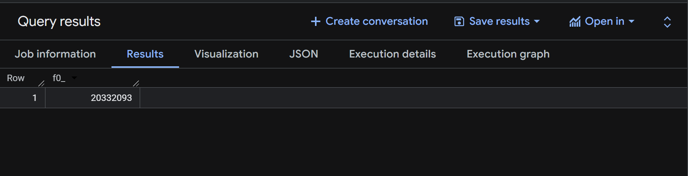
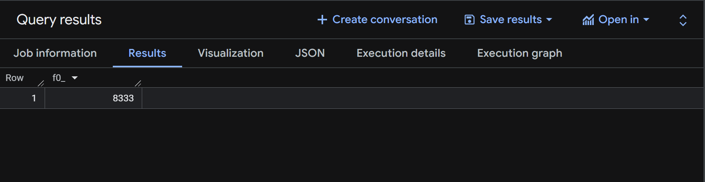

# DE-Zoomcamp-HW3

## Introduction

In this section, we will upload the data files to a Google Cloud Storage (GCS) bucket using a Python script. After that, we will create an external table and a regular (native) table in BigQuery using SQL.

## Load Data to a GCS Bucket

Before running the Python script, make sure you have a Google Cloud service account with the appropriate permissions. You do not need the Owner role; a more appropriate minimum role for this task is typically Storage Admin (or equivalent permissions to create a bucket and upload objects).

Place your service account JSON key file in the same folder as your Python script and name it service-account.json (or update the script to match your filename).

Create a Python script named ingest_data.py to download the NYC Yellow Taxi Parquet files (January–June 2024) and upload them to your GCS bucket.

```python 
import os
import sys
import urllib.request
from concurrent.futures import ThreadPoolExecutor
from google.cloud import storage
from google.api_core.exceptions import NotFound, Forbidden
import time


# Change this to your bucket name
BUCKET_NAME = "ammar-zoomcamp-hw3"

# If you authenticated through the GCP SDK you can comment out these two lines
CREDENTIALS_FILE = "service-account.json"
client = storage.Client.from_service_account_json(CREDENTIALS_FILE)
# If commented initialize client with the following
# client = storage.Client(project='zoomcamp-mod3-datawarehouse')


BASE_URL = "https://d37ci6vzurychx.cloudfront.net/trip-data/yellow_tripdata_2024-"
MONTHS = [f"{i:02d}" for i in range(1, 7)]
DOWNLOAD_DIR = "."

CHUNK_SIZE = 8 * 1024 * 1024

os.makedirs(DOWNLOAD_DIR, exist_ok=True)

bucket = client.bucket(BUCKET_NAME)


def download_file(month):
    url = f"{BASE_URL}{month}.parquet"
    file_path = os.path.join(DOWNLOAD_DIR, f"yellow_tripdata_2024-{month}.parquet")

    try:
        print(f"Downloading {url}...")
        urllib.request.urlretrieve(url, file_path)
        print(f"Downloaded: {file_path}")
        return file_path
    except Exception as e:
        print(f"Failed to download {url}: {e}")
        return None


def create_bucket(bucket_name):
    try:
        # Get bucket details
        bucket = client.get_bucket(bucket_name)

        # Check if the bucket belongs to the current project
        project_bucket_ids = [bckt.id for bckt in client.list_buckets()]
        if bucket_name in project_bucket_ids:
            print(
                f"Bucket '{bucket_name}' exists and belongs to your project. Proceeding..."
            )
        else:
            print(
                f"A bucket with the name '{bucket_name}' already exists, but it does not belong to your project."
            )
            sys.exit(1)

    except NotFound:
        # If the bucket doesn't exist, create it
        bucket = client.create_bucket(bucket_name)
        print(f"Created bucket '{bucket_name}'")
    except Forbidden:
        # If the request is forbidden, it means the bucket exists but you don't have access to see details
        print(
            f"A bucket with the name '{bucket_name}' exists, but it is not accessible. Bucket name is taken. Please try a different bucket name."
        )
        sys.exit(1)


def verify_gcs_upload(blob_name):
    return storage.Blob(bucket=bucket, name=blob_name).exists(client)


def upload_to_gcs(file_path, max_retries=3):
    blob_name = os.path.basename(file_path)
    blob = bucket.blob(blob_name)
    blob.chunk_size = CHUNK_SIZE

    create_bucket(BUCKET_NAME)

    for attempt in range(max_retries):
        try:
            print(f"Uploading {file_path} to {BUCKET_NAME} (Attempt {attempt + 1})...")
            blob.upload_from_filename(file_path)
            print(f"Uploaded: gs://{BUCKET_NAME}/{blob_name}")

            if verify_gcs_upload(blob_name):
                print(f"Verification successful for {blob_name}")
                return
            else:
                print(f"Verification failed for {blob_name}, retrying...")
        except Exception as e:
            print(f"Failed to upload {file_path} to GCS: {e}")

        time.sleep(5)

    print(f"Giving up on {file_path} after {max_retries} attempts.")


if __name__ == "__main__":
    create_bucket(BUCKET_NAME)

    with ThreadPoolExecutor(max_workers=4) as executor:
        file_paths = list(executor.map(download_file, MONTHS))

    with ThreadPoolExecutor(max_workers=4) as executor:
        executor.map(upload_to_gcs, filter(None, file_paths))  # Remove None values

    print("All files processed and verified.")
```
After that, install the required dependencies on your local machine:

```bash 
python -m venv .venv
source .venv/bin/activate   # Linux/Mac

pip install google-cloud-storage
```
Finally, run your Python script:

```bash 
python load_yellow_taxi_data.py
```
## Output


## Make External and Reguler Table in Bigquery

After the data has been uploaded to the bucket, the next step is to create an external table in BigQuery. An external table allows BigQuery to query data that is stored in Google Cloud Storage (GCS) without first loading or copying the data into BigQuery’s native storage.

```sql 
CREATE OR REPLACE EXTERNAL TABLE `zoomcamp_hw3.yellow_trip_data_ext`
OPTIONS (format='PARQUET', uris=['gs://ammar-zoomcamp-hw3/yellow_tripdata_2024-*.parquet']);

CREATE OR REPLACE EXTERNAL TABLE `zoomcamp_hw3.yellow_trip_data_ext_2024_01`
OPTIONS (format='PARQUET', uris=['gs://ammar-zoomcamp-hw3/yellow_tripdata_2024-01.parquet']);

CREATE OR REPLACE EXTERNAL TABLE `zoomcamp_hw3.yellow_trip_data_ext_2024_02`
OPTIONS (format='PARQUET', uris=['gs://ammar-zoomcamp-hw3/yellow_tripdata_2024-02.parquet']);

CREATE OR REPLACE EXTERNAL TABLE `zoomcamp_hw3.yellow_trip_data_ext_2024_03`
OPTIONS (format='PARQUET', uris=['gs://ammar-zoomcamp-hw3/yellow_tripdata_2024-03.parquet']);

CREATE OR REPLACE EXTERNAL TABLE `zoomcamp_hw3.yellow_trip_data_ext_2024_04`
OPTIONS (format='PARQUET', uris=['gs://ammar-zoomcamp-hw3/yellow_tripdata_2024-04.parquet']);

CREATE OR REPLACE EXTERNAL TABLE `zoomcamp_hw3.yellow_trip_data_ext_2024_05`
OPTIONS (format='PARQUET', uris=['gs://ammar-zoomcamp-hw3/yellow_tripdata_2024-05.parquet']);

CREATE OR REPLACE EXTERNAL TABLE `zoomcamp_hw3.yellow_trip_data_ext_2024_06`
OPTIONS (format='PARQUET', uris=['gs://ammar-zoomcamp-hw3/yellow_tripdata_2024-06.parquet']);
```
After the external table has been created in BigQuery, the next step is to create a regular (native) BigQuery table as the final table for analysis. A regular table (also called a native BigQuery table) stores the data inside BigQuery’s own managed storage. This is different from an external table, which only references files stored in Google Cloud Storage (GCS).

```sql
CREATE OR REPLACE TABLE zoomcamp_hw3.yellow_tripdata_2024 AS ( 
  SELECT * FROM ammar-zoomcamp.zoomcamp_hw3.yellow_trip_data_ext
);
CREATE OR REPLACE TABLE zoomcamp_hw3.yellow_tripdata_2024_01 AS ( 
  SELECT * FROM ammar-zoomcamp.zoomcamp_hw3.yellow_trip_data_ext_2024_01
);
CREATE OR REPLACE TABLE zoomcamp_hw3.yellow_tripdata_2024_02 AS ( 
  SELECT * FROM ammar-zoomcamp.zoomcamp_hw3.yellow_trip_data_ext_2024_02
);
CREATE OR REPLACE TABLE zoomcamp_hw3.yellow_tripdata_2024_03 AS ( 
  SELECT * FROM ammar-zoomcamp.zoomcamp_hw3.yellow_trip_data_ext_2024_03
);
CREATE OR REPLACE TABLE zoomcamp_hw3.yellow_tripdata_2024_04 AS ( 
  SELECT * FROM ammar-zoomcamp.zoomcamp_hw3.yellow_trip_data_ext_2024_04
);
CREATE OR REPLACE TABLE zoomcamp_hw3.yellow_tripdata_2024_05 AS ( 
  SELECT * FROM ammar-zoomcamp.zoomcamp_hw3.yellow_trip_data_ext_2024_05
);
CREATE OR REPLACE TABLE zoomcamp_hw3.yellow_tripdata_2024_05 AS ( 
  SELECT * FROM ammar-zoomcamp.zoomcamp_hw3.yellow_trip_data_ext_2024_05
);
CREATE OR REPLACE TABLE zoomcamp_hw3.yellow_tripdata_2024_06 AS ( 
  SELECT * FROM ammar-zoomcamp.zoomcamp_hw3.yellow_trip_data_ext_2024_06
);
```

## Question 1 

```sql
SELECT COUNT (*) FROM ammar-zoomcamp.zoomcamp_hw3.yellow_tripdata_2024;
```



## Question 2

```sql 
SELECT DISTINCT PULocationID FROM ammar-zoomcamp.zoomcamp_hw3.yellow_tripdata_2024;
```


```sql
SELECT DISTINCT PULocationID FROM ammar-zoomcamp.zoomcamp_hw3.yellow_trip_data_ext; 
```


## Question 3

```sql
SELECT DISTINCT PULocationID FROM ammar-zoomcamp.zoomcamp_hw3.yellow_tripdata_2024;

SELECT DISTINCT PULocationID, DOLocationID FROM ammar-zoomcamp.zoomcamp_hw3.yellow_tripdata_2024;
```

Answer : BigQuery is a columnar database, and it only scans the specific columns requested in the query. Querying two columns (PULocationID, DOLocationID) requires reading more data than querying one column (PULocationID), leading to a higher estimated number of bytes processed.

## Question 4

```sql
SELECT DISTINCT COUNT (*) 
FROM ammar-zoomcamp.zoomcamp_hw3.yellow_tripdata_2024
WHERE fare_amount = 0;
```


## Question 5

```sql
CREATE OR REPLACE TABLE zoomcamp_hw3.yellow_tripdata_2024_partition_cluster 
PARTITION BY DATE (tpep_dropoff_datetime)
CLUSTER BY VendorID AS (
  SELECT * FROM ammar-zoomcamp.zoomcamp_hw3.yellow_tripdata_2024
);
```

## Question 6

```sql
SELECT DISTINCT VendorID 
FROM ammar-zoomcamp.zoomcamp_hw3.yellow_tripdata_2024
WHERE tpep_dropoff_datetime BETWEEN '2024-03-01' AND '2024-03-15';
```


```sql
SELECT DISTINCT VendorID 
FROM zoomcamp_hw3.yellow_tripdata_2024_partition_cluster 
WHERE tpep_dropoff_datetime BETWEEN '2024-03-01' AND '2024-03-15';
```


## Question 7

Answer: GCP Bucket

## Question 8

Answer: False
